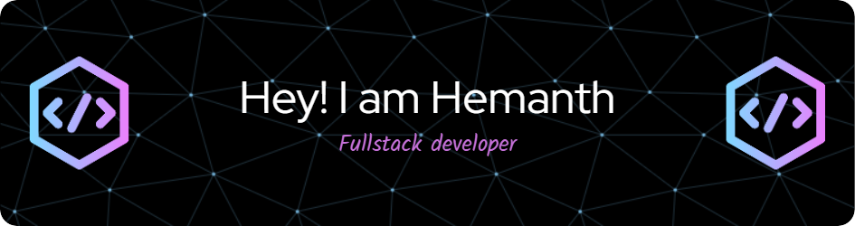

<!--
**hems-07/hems-07** is a ✨ _special_ ✨ repository because its `README.md` (this file) appears on your GitHub profile.
-->

<!-- Add a banner image -->

## 🚀 Tech Stack

<!-- Programming Languages -->

🔭 I’m currently working on:
- **PKGNN (Patient Knowledge Graph Framework)**: A research project focused on biomedical data prediction, using the MIMIC IV-Clinical dataset.
- Enhancing my **GitHub** with more open-source contributions and impactful projects.

🌱 I’m currently learning:
- **Advanced Machine Learning** techniques
- Deepening my knowledge in **React.js** and **Node.js**

👯 I’m looking to collaborate on:
- Open-source projects involving **Machine Learning** or **Web Development**.
- Projects focused on **biomedical data analysis** or **healthcare tech solutions**.

🤔 I’m looking for help with:
- Exploring **advanced data science models** and **efficient cloud deployment** strategies.

💬 Ask me about:
- Anything related to **Machine Learning**, **Data Structures and Algorithms**, or **Web Development**.
- My experience with developing **signature forgery detection systems** and **smart agro advisory systems**.

## 🌐 Connect with me:

😄 Pronouns: He/Him

⚡ Fun fact: I’m a huge cricket enthusiast and love playing badminton in my free time!
